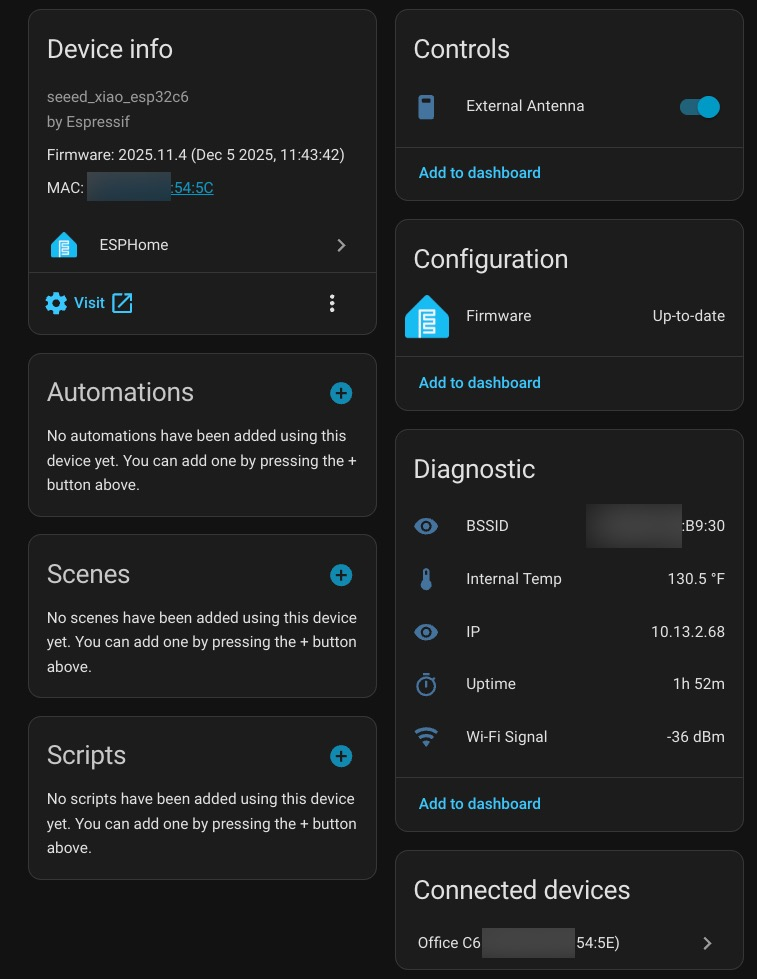

# Seeed XIAO ESP32‑C6 ESPHome Builder Package

This repository contains a reusable **ESPHome Builder package** for the Seeed XIAO ESP32‑C6 (esp32c6) boards. The project provides a shared base configuration package that can be included in device YAMLs to keep device files concise and consistent. The configuration is tailored for Home Assistant Bluetooth proxy and scanning functionality. I use it with the "Bermuda BLE Trilateration" HACS add-on for room-level presence detection. 

Quick overview

- Purpose: maintain one canonical, reusable base configuration for Seeed XIAO ESP32‑C6 boards and simple device examples that include it.

- Layout:

  - `examples/` — device example YAMLs and helpers.

  - `examples/common/Seeed xiao ESP32-c6 base.yaml` — shared base configuration (board, wifi, API/OTA, sensors, antenna outputs).

## How to use the base package

The generic device YAML includes the ESP32-C6 base configuration via `packages` and provide substitutions:

```yaml
substitutions:
  device_name: esphomec6-garage
  friendly_name: Garage C6
  api_key: "ZmFrZWFwaWtleWZha2VleGFtcGxlZmFrZWtleQ=="
  ota_password: "ChangeMe!2025"

esphome:
  name: ${device_name}
  friendly_name: ${friendly_name}

packages:
  device: !include "common/Seeed xiao ESP32-c6 base.yaml"
```

The base configuration uses the `${api_key}` and `${ota_password}` from your device specific YAML, and uses `!secret` for Wi‑Fi values (managed by ESPHome Builder).

What the base config provides:

- Board & SDK: selects `esp32c6` variant and `seeed_xiao_esp32c6` board, and sets `esp-idf` sdkconfig options.

- Boot actions: toggles GPIOs used for antenna selection on boot.

- Logger & status LED: configures serial log level and board LED behavior.

- API & OTA: supports encrypted API (uses `${api_key}`) and OTA (uses `${ota_password}`).

- Wi‑Fi: uses `!secret` for `wifi_ssid`, `wifi_password`, and `wifi_captive`; provides fallback captive AP settings.

- BLE: enables BLE scanning and Bluetooth proxying with optimized scan parameters (211ms interval, 180ms window, continuous scanning) for accurate presence detection.

- Sensors: uptime, internal temperature, Wi‑Fi signal, Wi‑Fi info, and SNTP time.

- Antenna control: a template switch manages two outputs (`ant_gpio3`, `ant_gpio14`) defined in the base.

## Using with ESPHome Builder

This is an **ESPHome Builder package** designed to work seamlessly with the ESPHome Builder tool in Home Assistant:

1. Install the ESPHome and ESPHome Device Builder add-ons from the Home Assistant Add-on Store
2. In your ESPHome configuration directory, create a `common` folder:

   ```text
   config/
   └── esphome/
       └── common/
           └── Seeed xiao ESP32-c6 base.yaml  ← Place the base config here
   ```

3. Copy the `Seeed xiao ESP32-c6 base.yaml` file to the `config/esphome/common/` directory
4. Create your device YAML using the exact contents of `examples/ESPHome device config.yaml`:
   - Update the `device_name` and `friendly_name` substitutions for your specific device
   - Generate new `api_key` and `ota_password` values (ESPHome Builder can generate these)
   - The file should include the base via `packages: device: !include "common/Seeed xiao ESP32-c6 base.yaml"`
5. ESPHome Builder automatically handles:
   - Wi-Fi secrets storage (no manual `secrets.yaml` needed)
   - Firmware compilation
   - Initial upload to your ESP32-C6 device
6. The device will automatically be discovered by Home Assistant

**Note:** The base configuration uses `!secret` references for Wi-Fi credentials, which ESPHome Builder manages automatically. You only need to provide the `api_key` and `ota_password` substitutions in your device YAML. To get fresh API and OTA keys, I suggest creating a new device in ESPHome Device Builder (using any hardware model), then replace all of the YAML with my device file but re-use the fresh API/OTA keys. 

## ESPHome Device Page

Here's what the device looks like in Home Assistant's ESPHome integration:



The device page shows:
- **Device info**: Board type, firmware version, and MAC address
- **Controls**: External antenna toggle switch
- **Configuration**: Firmware management and OTA updates
- **Diagnostic**: BSSID, internal temperature, IP address, uptime, and Wi-Fi signal strength
