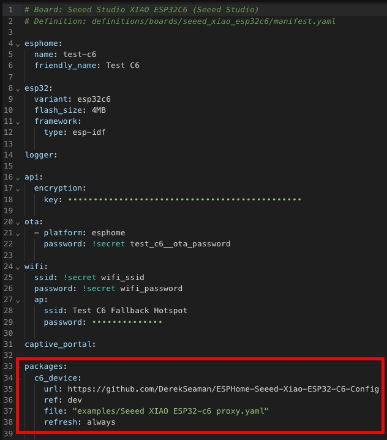
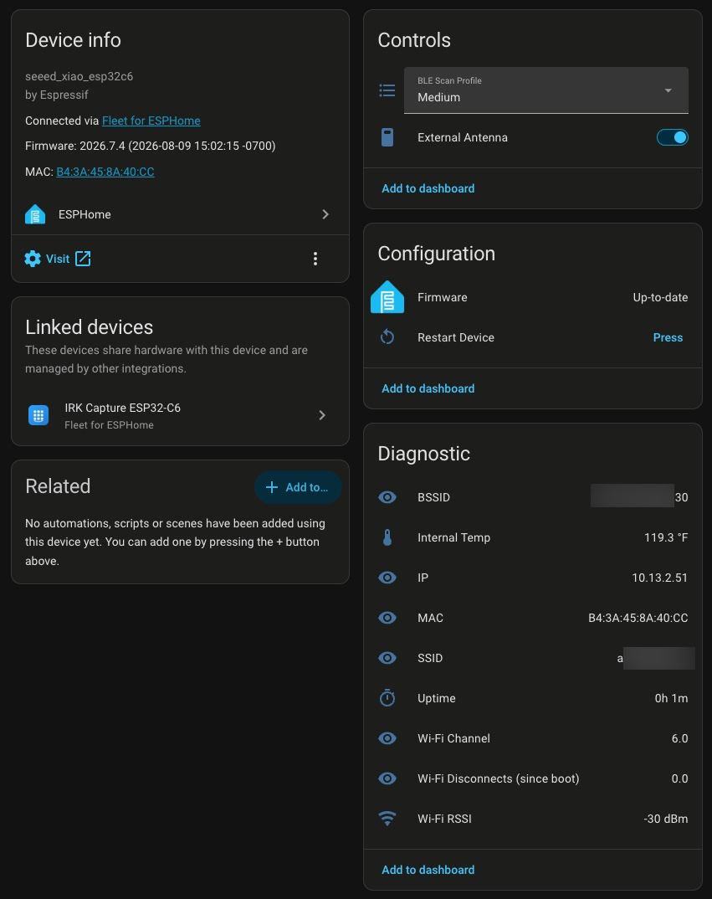

# Seeed Studio XIAO ESP32‑C6 ESPHome Device Builder Package

This repository contains a reusable **ESPHome Device Builder package** for the Seeed Studio XIAO ESP32‑C6 (esp32c6) boards. Several configurations are provided for you to choose from. Each configuration is covered below. These are designed to work with ESPHome Device Builder 2026.7 and later.

Quick overview

- Layout:

  - `examples/Seeed XIAO ESP32-c6 base.yaml` — C6 base configuration (board, wifi, sensors, antenna control, etc.), no Bluetooth proxy

  - `examples/Seeed XIAO ESP32-c6 IRK.yaml` — C6 board specifics designed to be used with my IRK Capture package (see below)

  - `examples/Seeed XIAO ESP32-c6 proxy.yaml` — C6 base configuration with customizable Bluetooth proxy functionality

  - `examples/Seeed XIAO ESP32-c6 remote.yaml` — Package definition designed to be used with a generic ESPHome Device Builder C6 device configuration. This will reference one of the above configurations and dynamically pull it in at compile time.

**Key feature:** The XIAO ESP32-C6 supports Wi-Fi 6 (802.11ax) at 2.4 GHz and includes a **software-controlled external antenna switch** (FM8625H RF switch), letting you choose between the onboard ceramic antenna and an external U.FL antenna at runtime.

## Using with ESPHome Device Builder

This is an **ESPHome Device Builder package** designed to work seamlessly with the ESPHome Device Builder tool in Home Assistant. Follow these steps to create a new device with the custom Seeed Studio XIAO ESP32-C6 configuration:

1. Install the **ESPHome Device Builder** add-on from the Home Assistant Add-on Store
2. Go into the **ESPHome Device Builder** and in the upper right click on **+ Create device**
3. Select **Create new project**
4. Click on **ESP32-C6**, then type **Seeed** in the search boards field
5. Click **+ Select** on the **Seeed Studio XIAO ESP32C6** card
6. Enter a device name, click **Finish Setup**
7. Paste the contents of the C6 remote file to the bottom of your ESPHome Device Builder template [C6 Remote File](https://github.com/DerekSeaman/ESPHome-Seeed-Xiao-ESP32-C6-Config/blob/main/examples/Seeed%20XIAO%20ESP32-c6%20remote.yaml)
8. Depending on which version you want, modify **file:** as needed (proxy, base, IRK)
9. Modify any other settings as needed, then install to your Seeed Studio XIAO ESP32-C6 device.

Your configuration should look something like this.

## IRK Configuration Details

I built a special C6 IRK configuration that is designed to be used with my IRK Capture package for ESPHome. It can be found at: [DerekSeaman/irk-capture](https://github.com/DerekSeaman/irk-capture). This eliminates some of the duplicate settings already built into my IRK Capture package and only adds the unique settings needed for the Seeed Studio XIAO ESP32-C6.

## External Antenna

The Seeed Studio XIAO ESP32-C6 has an onboard ceramic antenna and a U.FL connector for an external antenna, switched in software via an FM8625H RF switch. Both `base.yaml` and `proxy.yaml` default to the external antenna on boot and expose an **External Antenna** toggle switch so you can switch to the onboard antenna instead. The `IRK.yaml` configuration also defaults to the external antenna on boot and exposes the same toggle switch. If you don't have an external antenna connected, turn this switch off to use the onboard antenna.

## Bluetooth Proxy

If you use the **proxy** configuration, your C6 will act as a Bluetooth proxy. I created three scan profiles: low, medium, and high. Depending on your needs, you can set the scan profile as needed. If you are using the proxy with room-level presence detection, medium or high is recommended. Otherwise, low should be sufficient and will use less Wi-Fi bandwidth.

## Status LED Patterns

The onboard LED (GPIO15, yellow USER LED) provides visual feedback about the device state:

| Pattern | Meaning |
|---------|---------|
| Solid ON | Everything OK - WiFi connected, API connected with active client |
| Slow blink (~1Hz) | Warning - WiFi connected but API client not connected/subscribed |
| Fast blink (~2-3Hz) | Error - No WiFi connection |
| Very fast blink (~10Hz) | Critical error during boot or OTA in progress |

## ESPHome Device Page

Here's what the proxy device looks like in Home Assistant's ESPHome integration:

The device page shows:

- **Device info**: Board type, firmware version, and MAC address
- **Controls**: BLE Scan Profile selector (Low/Medium/High) and External Antenna toggle
- **Configuration**: Firmware management and OTA updates
- **Diagnostic**: BSSID, internal temperature, IP address, MAC address, SSID, uptime, Wi-Fi Channel, Wi-Fi disconnects (since boot), and Wi-Fi RSSI
